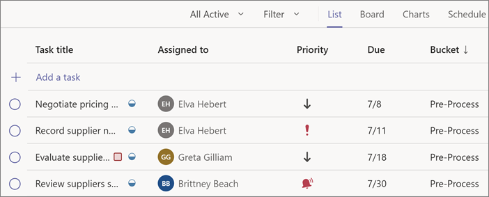
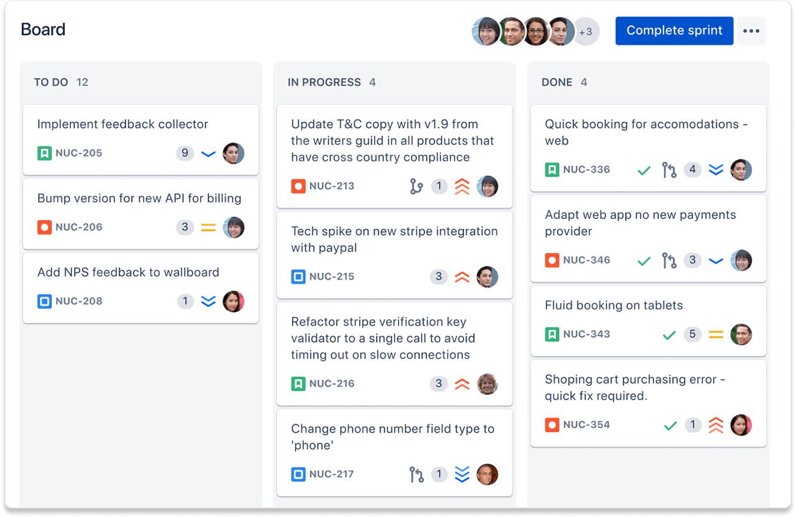
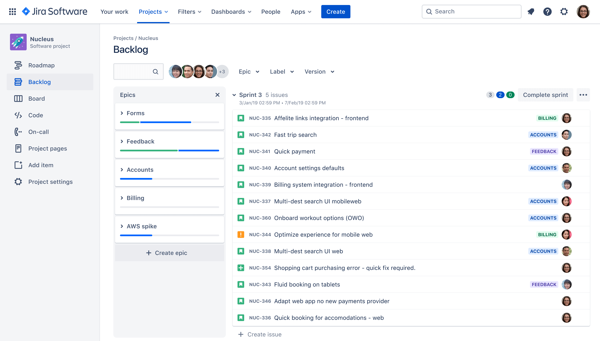

::::::::::::::::::::::::::::::::::::::: objectives

- Facilitate contributions from present and future collaborators
- Learn to treat every project as a collaborative project
- Describe a project in a README file
- Understand what software licenses are and how they might apply to your project

::::::::::::::::::::::::::::::::::::::::::::::::::

:::::::::::::::::::::::::::::::::::::::: questions

- What do collaborators need to know to contribute to my project?
- How can documentation make my project more efficient?
- What is a license and does my project need one?

::::::::::::::::::::::::::::::::::::::::::::::::::

You may start working on projects by yourself or with a small group of
collaborators you already know, but you should design it to make it easy
for new collaborators to join. These collaborators might be new grad
students or postdocs in the lab, or they might be *you* returning to a
project that has been idle for some time. As summarized in
[[steinmacher2015](https://www.sciencedirect.com/science/article/abs/pii/S0950584914002390?via%3Dihub)], you want to make it easy for people to set up a local
workspace so that they *can* contribute, help them find tasks so that
they know *what* to contribute, and make the contribution process clear
so that they know *how* to contribute. You also want to make it easy for
people to give you credit for your work.

::::::::::::::::::::::::::::::::::::::  discussion

## Collaboration opportunities and challenges

Discussion

- How does collaboration help in scientific computing?
- What goes wrong with collaboration?
- How can you prepare to collaborate?

:::::::::::::::::  spoiler

## Suggestions

How collaboration can help:

- Collaboration brings other ideas and perspectives on your project
- Describing your project to (potential) collaborators can help to focus the project
- Thinking about other people helps you to return to your project later

What can go wrong with collaboration:

- People can be confused about:
- Goals: what are we trying to do?
- Process: what tools will we use, how will we do it?
- Responsibilities: whose job is it to do this thing?
- Credit: how are contributions going to be recognized?
- Data: how do we share sensitive data?
- Timelines: when will people finish their tasks?

How to prepare for collaboration:

- Document important things
- Decide on goals and a way of working (process)
- Clarify the scope and audience of your project
- Highlight outstanding issues

:::::::::::::::::::::::::

::::::::::::::::::::::::::::::::::::::::::::::::::

## Create an overview of your project

Written documentation is essential for collaboration.
Future you will forget things, and your collaborators will not know them in the first place.
An overview document can collect the most important information about your project,
and act as a signpost.
The overview is usually the first thing people read about your project, so it is often called a "README".
The README has two jobs: describing the contents of the project, and explaining how to interact with the project.

Create a short file in the
project's home directory that explains the purpose of the project.
This file (generally called `README`, `README.txt`, or something
similar) should contain :

- The project's title
- A brief description
- Up-to-date contact information
- An example or two of how to run the most important tasks
- Overview of folder structure

## Describe how to contribute to the project

Because the README is usually the first thing
users and collaborators on your project will look at, make it
explicit how you want people to engage with the project. If you are
looking for more contributors, make it explicit that you welcome
contributors and point them to the license (more below) and ways
they can help.

A separate `CONTRIBUTING` file can also describe what
people need to do in order to get the project going and use or
contribute to it:

- Dependencies that need to be installed
- Tests that can be run to ensure that software has been installed correctly
- Guidelines or checklists that your project adheres to.

This information is very helpful and will be forgotten over time unless it's documented inside the project.

:::::::::::::::::::::::::::::::::::::::  challenge

## Comparing README files

Here is a README file for a data project and one for a software project.
What useful and important information is present, and what is missing?
[Data Project README](https://github.com/ewallace/pseudonuclease_evolution_2020)  
[Software Project README](https://github.com/DualSPHysics/DualSPHysics)

:::::::::::::::  solution

## Solution

This Data Project README:

- Contains a DOI
- Describes the purpose of the code and links to a related paper
- Describes the project structure
- Includes a license
- DOES NOT contain requirements
- DOES NOT include a working example
- DOES NOT include a explicit list of authors (can be inferred from paper though)

This Software Project README:

- Describes the purpose of the code
- Describes the requirements
- Includes instructions for various type of users
- Describes how to contribute
- Includes a working example
- Includes a license
- DOES NOT include an explicit DOI
- DOES NOT describe the project structure
  
  

:::::::::::::::::::::::::

::::::::::::::::::::::::::::::::::::::::::::::::::

## Decide on communication strategies

Make explicit decisions about (and publicize where appropriate) how members of the
project will communicate with each other and with external users /
collaborators. This includes the location and technology for email
lists, chat channels, voice / video conferencing, documentation, and
meeting notes, as well as which of these channels will be public or
private.

Supported tools within CSIRO include [Confluence](https://confluence.csiro.au/),
for wiki-style shared documentation, and Microsoft Teams, for online discussions,
video conferencing, file sharing and more.

Not supported, but worth knowing of is [Miro](https://miro.com/), which allows creating 
a shared, online whiteboard, where multiple people may be building up notes, diagrams,
graphs, etc., at the same time, with quite powerful tools.  
  
## Collaborations with sensitive data

If you determine that your project will include work with sensitive data, it is important to agree with collaborators on how and where the data will be stored, as well as what the mechanisms for sharing the data will be and who is ultimately responsible for ensuring these are followed.

## Create a shared "to-do" list

Organising a structured to-do list of tasks still to complete and overall project work
plan can be really useful whether collaborating with others or just with your future self.
There are many options and tools available for how to do this.

- If your project is centered around a Git-tracked repository, it could be as simple
as updating a text file like `notes.txt` or `todo.txt`.

- Or make use of the ability to track "issues" on 
[BitBucket](https://support.atlassian.com/bitbucket-cloud/docs/understand-bitbucket-issues/)
or [GitHub](https://docs.github.com/en/issues/tracking-your-work-with-issues/about-issues). 
The "issues" feature on online Git repositories allows you or others to describe work that needs
to be done (often used on public repositories for reporting bugs in software), 
create and follow discussions about the issues/tasks, and link the closing of the issues 
to commits/pull-requests.
E.g.: [Issues for original version of this lesson](https://github.com/carpentries-lab/good-enough-practices/issues)

- Microsoft Teams 'Tasks'. Teams now lets you 
[add a 'Tasks' app/tab to a team space](https://support.microsoft.com/en-au/office/use-the-tasks-app-in-teams-e32639f3-2e07-4b62-9a8c-fd706c12c070), 
which then lets create a to-do list, assign tasks to people, and lets you track and view the
tasks in various ways.
{alt="An example of Teams Tasks list view"}

- [Jira](https://jira.csiro.au/) is another tool supported and deployed in CSIRO. Developed by
Australian software company [Atlassian](https://www.atlassian.com/software/jira), it allows 
tracking of to-do tasks/issues and sub-tasks, lets you assign tasks to people, and lets 
you track and view tasks in the context of worflows, timelines, and "board" visualisations,
such as the "Kanban board". Jira can directly integrate with both BitBucket
and Confluence, with Jira tasks able to be linked, referenced and tracked in each.
Jira can be a very powerful tool if fully embraced, but can also be a bit clunky to starting out.

{alt="An example of a Jira Kanban board"}
A Kanban board example, from [Jira's website](https://www.atlassian.com/software/jira/templates/scrum).  

{alt="An example of a Jira Backlog"}
A "backlog" view example, from [Jira's website](https://www.atlassian.com/software/jira/templates/scrum).  


## Make the license explicit

:::::::::::::::::::::::::::::::::::::::::  callout

## What is a licence?

- Specifies allowable copying and reuse
- Without a licence, people cannot legally reuse your code or data
- Different options for different goals and funder requirements (Apache, MIT, CC, ...)
- For example, this lesson is reusable with attribution under a Creative Commons Attribution (CC BY) 4.0 licence
- Applies to all material in a project, e.g. data, text and code

::::::::::::::::::::::::::::::::::::::::::::::::::

Have a `LICENSE` file
in the project's home directory that clearly states what license(s)
apply to the project's software, data, and manuscripts. Lack of an
explicit license does not mean there isn't one; rather, it implies
the author is keeping all rights and others are not allowed to
re-use or modify the material.
A project that consists of data and text may benefit from a different license to a project consisting primarily of code.
  
**IM&T can help with advising on suitable licenses.**

The original authors of this lesson recommend Creative Commons licenses for data and text, either
[CC-0](https://creativecommons.org/share-your-work/public-domain/cc0/) (the "No Rights Reserved"
license) or [CC-BY](https://wellcome.org/grant-funding/guidance/creative-commons-attribution-licence-cc) (the "Attribution"
license, which permits sharing and reuse but requires people to give
appropriate credit to the creators). For software, we recommend a
permissive open source license such as the MIT, BSD, or Apache
license [[laurent2004](https://www.oreilly.com/library/view/understanding-open-source/0596005814/)].
A useful resource to compare different licenses is available at [tldrlegal](https://tldrlegal.com/). More advice for how to use licences for research data is available at [openaire](https://www.openaire.eu/research-data-how-to-license/).

> **What Not To Do**
> 
> We (the original authors) recommend *against* the "no commercial use" variations of the
> Creative Commons licenses because they may impede some forms of
> re-use. For example, if a researcher in a developing country is
> being paid by her government to compile a public health report,
> she will be unable to include your data if the license says
> "non-commercial". We recommend permissive software licenses rather
> than the GNU General Public License (GPL) because it is easier to
> integrate permissively-licensed software into other projects, see
> chapter three in [[laurent2004](https://www.oreilly.com/library/view/understanding-open-source/0596005814/)].

## Make the project citable

A `CITATION` file describes how to cite your
project as a whole, and where to find (and how to cite) any data
sets, code, figures, and other artifacts that have their own DOIs.
The example below shows the `CITATION` file for the
[Ecodata Retriever](https://github.com/weecology/retriever); for an example of
a more detailed `CITATION` file, see the one for the
[khmer](https://github.com/dib-lab/khmer) project.

```
Please cite this work as:

Morris, B.D. and E.P. White. 2013. "The EcoData Retriever:
improving access to existing ecological data." PLOS ONE 8:e65848.
http://doi.org/doi:10.1371/journal.pone.0065848
```  
  
More recently a standard for citation files has been developed in the form of CFF;
Citation File Format. Often saved in a CITATION.cff file, this format was proposed 
specifically for the purpose of holding expected information as a standardised set 
that was both human and machine readable. E.g.:
```
cff-version: 1.2.0
message: "If you use this software, please cite it as below."
authors:
  - family-names: Druskat
    given-names: Stephan
    orcid: https://orcid.org/1234-5678-9101-1121
title: "My Research Software"
version: 2.0.4
doi: 10.5281/zenodo.1234
date-released: 2021-08-11
```

More information on CFF is available here:  [citation-file-format.github.io](https://citation-file-format.github.io/)


## Recommended resources

- [The Turing Way Guide for Collaboration](https://the-turing-way.netlify.app/collaboration/collaboration.html)

:::::::::::::::::::::::::::::::::::::::::  callout

## Attribution

This episode was adapted from and includes material from Wilson et al.
[Good Enough Practices for Scientific Computing](https://github.com/swcarpentry/good-enough-practices-in-scientific-computing).


::::::::::::::::::::::::::::::::::::::::::::::::::


:::::::::::::::::::::::::::::::::::::::: keypoints

- Create an overview of your project
- Create a shared “to-do” list
- Decide on communication strategies
- Make the license explicit
- Make the project citable

::::::::::::::::::::::::::::::::::::::::::::::::::


